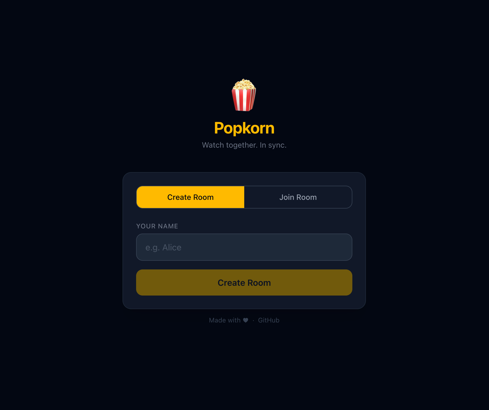
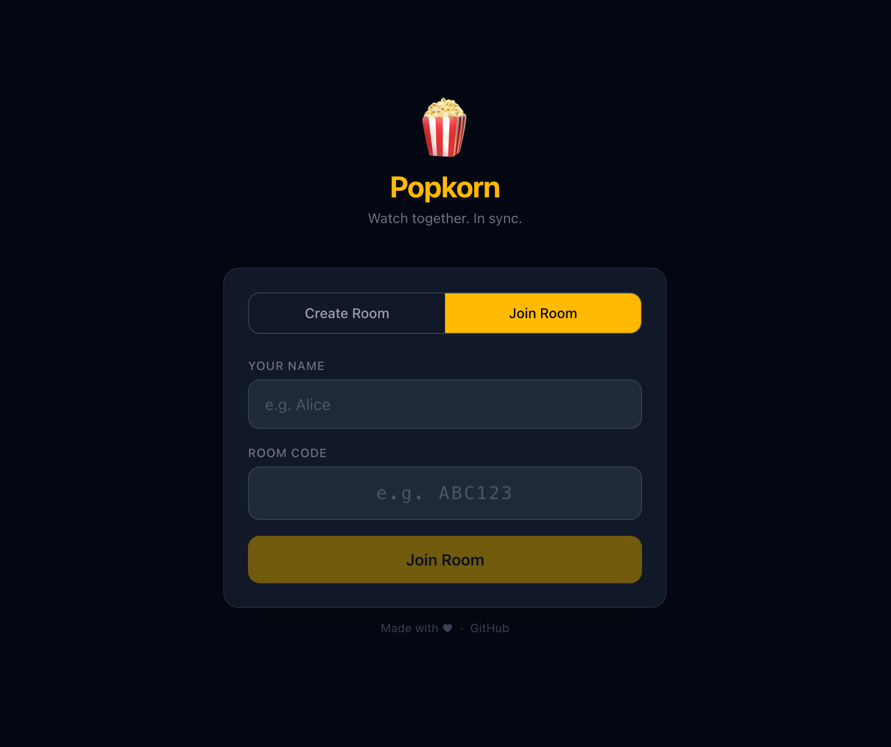
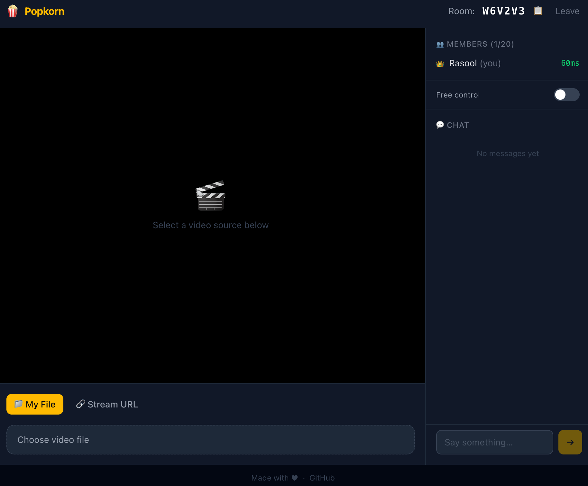

# 🍿 Popkorn

Watch videos together, in perfect sync — no account, no install, just a browser.

<p align="center">
  <a href="screenshots/popkorn.site-create-room.png"></a>
</p>

<p align="center">
  <a href="screenshots/popkorn.site-join-room.png"></a>
  &nbsp;&nbsp;
  <a href="screenshots/popkorn.site-room.png"></a>
</p>


## What it does

Popkorn lets multiple people watch the same video in sync inside a shared room — no account, no install, just a browser. Supports both local video files and direct streaming URLs.

- Real-time play / pause / seek sync with latency compensation
- Local files stay on your machine — nothing is uploaded
- Host controls who can drive playback
- Live chat and ping display per member


## Running with Docker

The easiest way to deploy Popkorn is with the pre-built image from Docker Hub.

```bash
docker run -d \
  --name popkorn \
  --restart unless-stopped \
  -p 3001:3001 \
  -e CORS_ORIGIN=https://your-domain.com \
  rasooll/popkorn:latest
```

Or with Docker Compose — create a `docker-compose.yml`:

```yaml
services:
  app:
    image: rasooll/popkorn:latest
    restart: unless-stopped
    ports:
      - "3001:3001"
    environment:
      CORS_ORIGIN: "https://your-domain.com"
```

Then run:

```bash
docker compose up -d
```

Once running, open `http://your-server:3001` in your browser.

### Environment variables

| Variable      | Default                   | Description                                      |
|---------------|---------------------------|--------------------------------------------------|
| `PORT`        | `3001`                    | Port the server listens on                       |
| `CORS_ORIGIN` | `http://localhost:3001`   | Allowed origin for Socket.io (set to your domain)|


## Requirements (local development)

- [mise](https://mise.jdx.dev) — used to manage the Node.js version


## Setup

```bash
# 1. Clone and enter the project
git clone https://github.com/rasooll/popkorn
cd popkorn

# 2. Trust the mise config and install Node 22
mise trust
mise install

# 3. Install all dependencies
mise run install
```


## Available tasks

| Command                        | Description                                          |
|--------------------------------|------------------------------------------------------|
| `mise run install`             | Install all npm dependencies (root, client, server)  |
| `mise run dev`                 | Start client and server in development mode          |
| `mise run test`                | Run all unit tests                                   |
| `mise run test:watch`          | Run tests in watch mode                              |
| `mise run docker:setup`        | Create the buildx builder (run once before pushing)  |
| `mise run docker-push <tag>`   | Build and push multi-platform image to Docker Hub    |


## Running in dev

```bash
mise run dev
```

This starts both servers concurrently:

| Service                       | URL                                        |
|-------------------------------|--------------------------------------------|
| Frontend (Vite)               | <http://localhost:5173>                    |
| Backend (Express + Socket.io) | <http://localhost:3001>                    |

The Vite dev server proxies `/socket.io` to port 3001 automatically — no manual CORS config needed.

To verify the backend is up:

```bash
curl http://localhost:3001/health
# {"status":"ok"}
```


## Building and publishing a Docker image

```bash
# First time only — create the multi-platform buildx builder
mise run docker:setup

# Build for linux/amd64 + linux/arm64 and push to Docker Hub
mise run docker-push v1.0.0
```


## Tests

```bash
mise run test
```

66 tests across client and server using [Vitest](https://vitest.dev).

| Package  | Framework                | Coverage                                              |
|----------|--------------------------|-------------------------------------------------------|
| `server` | Vitest                   | `roomManager` — all room lifecycle, state mutations   |
| `client` | Vitest + Testing Library | `fingerprint`, `RoomLobby`, `SourceSelector`          |


## Project structure

```text
popkorn/
├── .mise.toml           Node 22 + task definitions
├── .mise/tasks/         File-based mise tasks (docker-push)
├── Dockerfile           Multi-stage production build
├── docker-compose.yml   Production compose file
├── client/              React + Vite + TypeScript frontend
│   └── src/
│       ├── components/
│       ├── hooks/
│       ├── lib/
│       └── types/       ← all shared types live here
└── server/              Node.js + Express + Socket.io backend
    └── src/
```
